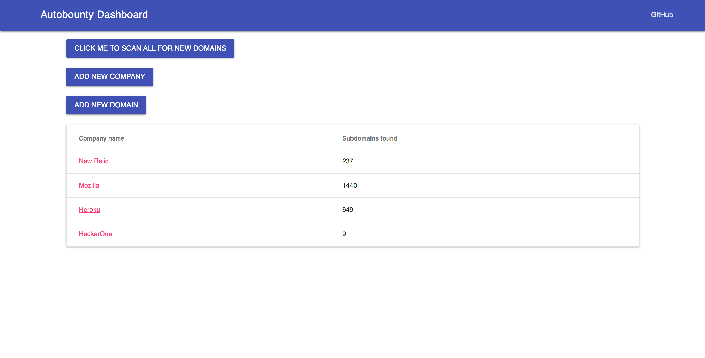

# autobounty

## Summary

Ultimately, I would like to use this tool to automate some of the common tasks
I perform when looking for security bug bounties. The user interacts with the
tool through the following dashboard:

### Stack

This is a Python application which depends on the following:

- MongoDB
- Flask
- Docker
- Python
- Celery

I will also be taking advantage of some tools out there like subbrute and Sublist3r.

### Setup

You can use `docker-compose` to run this application. Clone this repository and
run the command `docker-compose up` from the folder root.
